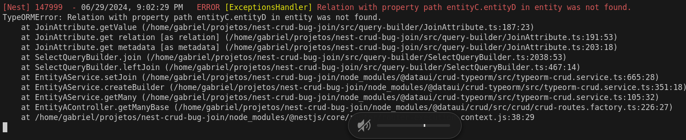

## Instructions to run

<br>

```bash
# Create .env file (change values if necessary)
cp .env.example .env

# Run docker compose to create database
docker compose up -d

# Install dependencies
npm ci

# Run application
npm run start:dev
```

Insert data
```bash
curl --request POST \
  --url http://localhost:3000/entity-a \
  --header 'Content-Type: application/json' \
  --data '{
	"name": "Entity A",
	"entityB": {
		"title": "Entity B",
		"entityC": {
			"description": "Entity C",
			"entityD": {
				"text": "Entity D"
			}
		}
	}
}'
```

Get with joins. If join has three or more levels, the error occurs
```bash
curl --request GET \
  --url 'http://localhost:3000/entity-a?join=entityB&join=entityB.entityC&join=entityB.entityC.entityD'
```
